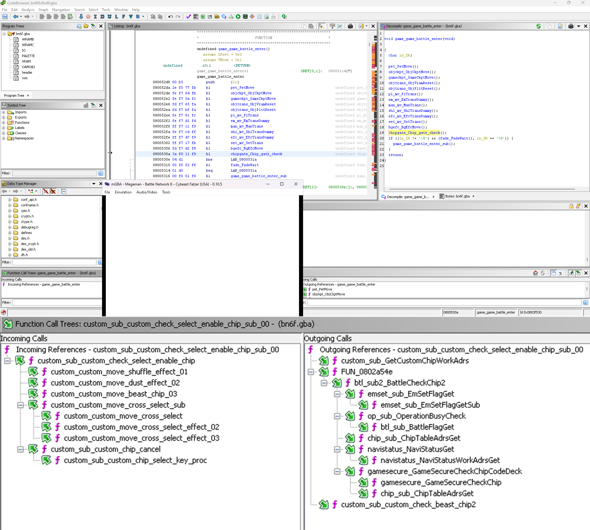
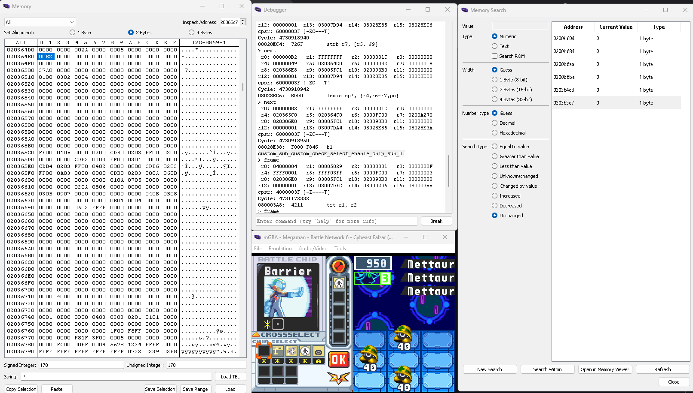
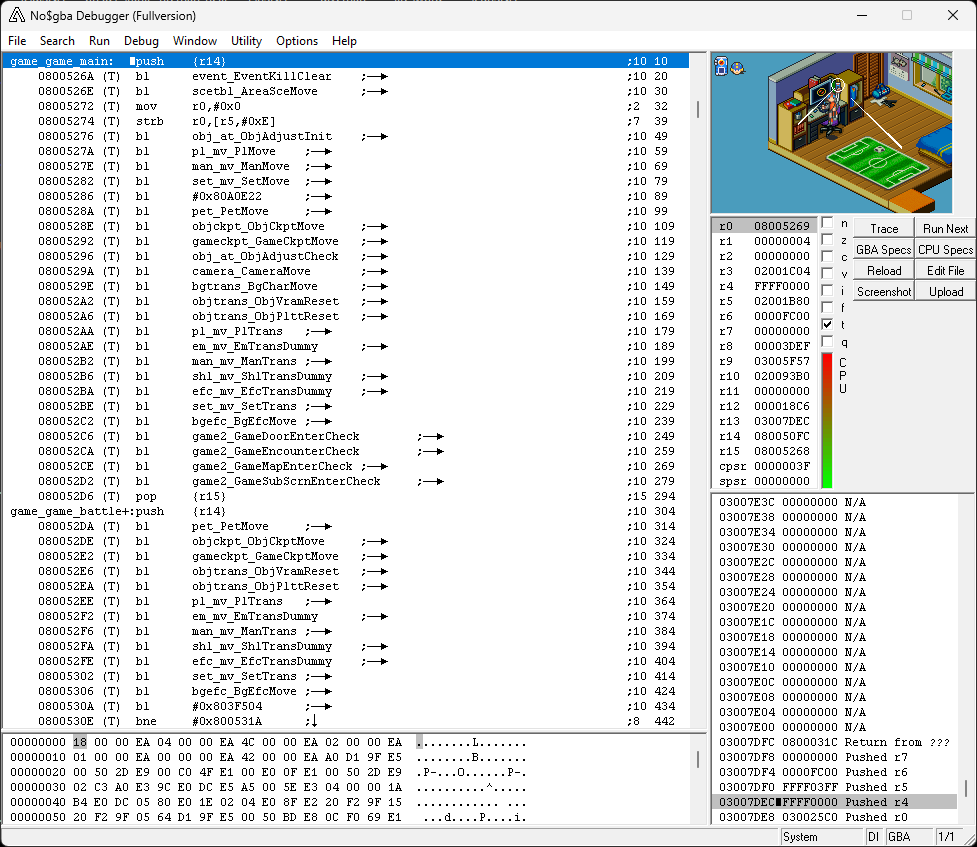

# Mega Man Battle Network 6 Symbols
This .sym file contains some of the original function names, as found in the Nintendo Switch release of Mega Man Battle Network Legacy Collection.
This file is primarily intended to assist in debugging with no$gba.

*Still a work in progress*

Contains 2 sym files:
+ `MEGAMAN6_GXX_BR5E00.sym` - Functions are prefixed by the file they were found in.
	+ e.g. The function `_AgbMain` in `main.cpp` is labeled `main_AgbMain`
+ `MEGAMAN6_GXX_BR5E00_min_prefix.sym` - Functions that are in CamelCase are not prefixed by the file they were found in.
	+ e.g. The function `_AgbMain` in `main.cpp` is labeled `_AgbMain`

### Ghidra
An importer script, `ImportNoGBASym.py` is included which allows for the sym files to be imorted to Ghidra.\
It currently attempts to create a label if no function exists in the address specified in the sym file.

The following tools are reccomended when using the symbols with Ghidra:
+ [DefineUndefinedFunctions.py](https://github.com/EliasTuning/Med9GhidraScripts/blob/main/general/DefineUndefinedFunctions.py)
	+ Used to define functions based on the labels `ImportNoGBASym.py` creates
+ [gba-ghidra-loader](pudii/gba-ghidra-loader)
	+ Automatically maps the ROM according to [GBATEK](https://problemkaputt.de/gbatek.htm) documentation
 
 

### mGBA
The .sym files work as-is with [mGBA 0.10.5](https://github.com/mgba-emu/mgba/releases/tag/0.10.5) stable release. GDB has not been tested yet.

### No$GBA

